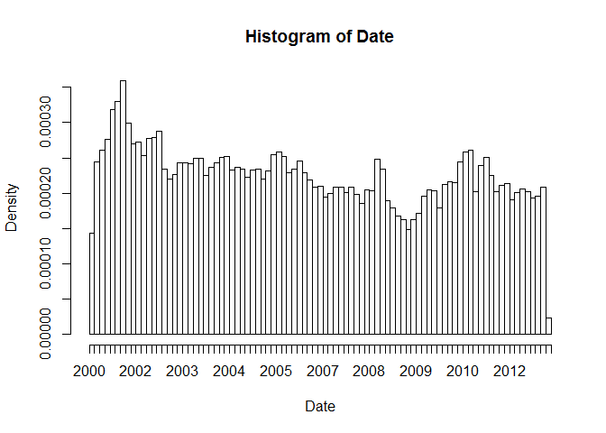
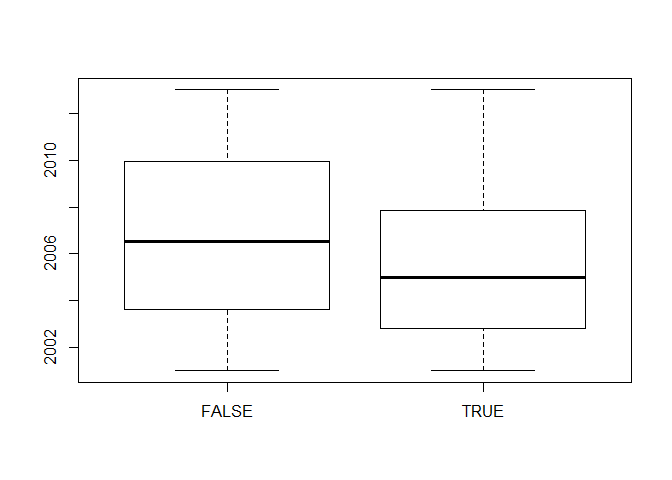

Crime Notebook
================

OBJECTIVE: AN ANALYTICAL DETECTIVE Crime is an international concern, but it is documented and handled in very different ways in different countries. In the United States, violent crimes and property crimes are recorded by the Federal Bureau of Investigation (FBI). Additionally, each city documents crime, and some cities release data regarding crime rates. The city of Chicago, Illinois releases crime data from 2001 onward online.

What is the local language?

``` r
Sys.getlocale()
```

    ## [1] "LC_COLLATE=French_France.1252;LC_CTYPE=French_France.1252;LC_MONETARY=French_France.1252;LC_NUMERIC=C;LC_TIME=French_France.1252"

Change the local to English

``` r
Sys.setlocale("LC_ALL","English")
```

    ## [1] "LC_COLLATE=English_United States.1252;LC_CTYPE=English_United States.1252;LC_MONETARY=English_United States.1252;LC_NUMERIC=C;LC_TIME=English_United States.1252"

Useful libraries

``` r
library("dplyr")
```

    ## Warning: package 'dplyr' was built under R version 3.3.2

    ## 
    ## Attaching package: 'dplyr'

    ## The following objects are masked from 'package:stats':
    ## 
    ##     filter, lag

    ## The following objects are masked from 'package:base':
    ## 
    ##     intersect, setdiff, setequal, union

``` r
library("ggplot2")
```

    ## Warning: package 'ggplot2' was built under R version 3.3.2

Read the dataset mvtWeek1.csv into R, using the read.csv function, and call the data frame "mvt". Remember to navigate to the directory on your computer containing the file mvtWeek1.csv first. It may take a few minutes to read in the data, since it is pretty large. Then, use the str and summary functions to answer the following questions

``` r
# import data
data <- read.csv("../data/mvtWeek1.csv")

# create data frame
mvt <- tbl_df(data)

# Analyse data
head(mvt)
```

    ## # A tibble: 6 × 11
    ##        ID           Date           LocationDescription Arrest Domestic
    ##     <int>         <fctr>                        <fctr>  <lgl>    <lgl>
    ## 1 8951354 12/31/12 23:15                        STREET  FALSE    FALSE
    ## 2 8951141 12/31/12 22:00                        STREET  FALSE    FALSE
    ## 3 8952745 12/31/12 22:00 RESIDENTIAL YARD (FRONT/BACK)  FALSE    FALSE
    ## 4 8952223 12/31/12 22:00                        STREET  FALSE    FALSE
    ## 5 8951608 12/31/12 21:30                        STREET  FALSE    FALSE
    ## 6 8950793 12/31/12 20:30                        STREET   TRUE    FALSE
    ## # ... with 6 more variables: Beat <int>, District <int>,
    ## #   CommunityArea <int>, Year <int>, Latitude <dbl>, Longitude <dbl>

LOADING THE DATA How many rows of data (observations) are in this dataset?

``` r
N = nrow(mvt)
L = ncol(mvt)
str(df)
```

    ## function (x, df1, df2, ncp, log = FALSE)

Using the "max" function, what is the maximum value of the variable "ID"?

``` r
max(mvt$ID)
```

    ## [1] 9181151

What is the minimum value of the variable "Beat"?

``` r
min(mvt$Beat)
```

    ## [1] 111

Simplification

``` r
 summary(mvt)
```

    ##        ID                      Date       
    ##  Min.   :1310022   5/16/08 0:00  :    11  
    ##  1st Qu.:2832144   10/17/01 22:00:    10  
    ##  Median :4762956   4/13/04 21:00 :    10  
    ##  Mean   :4968629   9/17/05 22:00 :    10  
    ##  3rd Qu.:7201878   10/12/01 22:00:     9  
    ##  Max.   :9181151   10/13/01 22:00:     9  
    ##                    (Other)       :191582  
    ##                      LocationDescription   Arrest         Domestic      
    ##  STREET                        :156564   Mode :logical   Mode :logical  
    ##  PARKING LOT/GARAGE(NON.RESID.): 14852   FALSE:176105    FALSE:191226   
    ##  OTHER                         :  4573   TRUE :15536     TRUE :415      
    ##  ALLEY                         :  2308   NA's :0         NA's :0        
    ##  GAS STATION                   :  2111                                  
    ##  DRIVEWAY - RESIDENTIAL        :  1675                                  
    ##  (Other)                       :  9558                                  
    ##       Beat         District     CommunityArea        Year     
    ##  Min.   : 111   Min.   : 1.00   Min.   : 0      Min.   :2001  
    ##  1st Qu.: 722   1st Qu.: 6.00   1st Qu.:22      1st Qu.:2003  
    ##  Median :1121   Median :10.00   Median :32      Median :2006  
    ##  Mean   :1259   Mean   :11.82   Mean   :38      Mean   :2006  
    ##  3rd Qu.:1733   3rd Qu.:17.00   3rd Qu.:60      3rd Qu.:2009  
    ##  Max.   :2535   Max.   :31.00   Max.   :77      Max.   :2012  
    ##                 NA's   :43056   NA's   :24616                 
    ##     Latitude       Longitude     
    ##  Min.   :41.64   Min.   :-87.93  
    ##  1st Qu.:41.77   1st Qu.:-87.72  
    ##  Median :41.85   Median :-87.68  
    ##  Mean   :41.84   Mean   :-87.68  
    ##  3rd Qu.:41.92   3rd Qu.:-87.64  
    ##  Max.   :42.02   Max.   :-87.52  
    ##  NA's   :2276    NA's   :2276

How many observations have a LocationDescription value of ALLEY?

``` r
summary(mvt$LocationDescription)
```

    ##                              ABANDONED BUILDING 
    ##                                               4 
    ## AIRPORT BUILDING NON-TERMINAL - NON-SECURE AREA 
    ##                                               4 
    ##     AIRPORT BUILDING NON-TERMINAL - SECURE AREA 
    ##                                               1 
    ##              AIRPORT EXTERIOR - NON-SECURE AREA 
    ##                                              24 
    ##                  AIRPORT EXTERIOR - SECURE AREA 
    ##                                               1 
    ##                             AIRPORT PARKING LOT 
    ##                                              11 
    ##  AIRPORT TERMINAL UPPER LEVEL - NON-SECURE AREA 
    ##                                               5 
    ##                   AIRPORT VENDING ESTABLISHMENT 
    ##                                              10 
    ##                                AIRPORT/AIRCRAFT 
    ##                                             363 
    ##                                           ALLEY 
    ##                                            2308 
    ##                                 ANIMAL HOSPITAL 
    ##                                               1 
    ##                                       APARTMENT 
    ##                                             184 
    ##                                 APPLIANCE STORE 
    ##                                               1 
    ##                                   ATHLETIC CLUB 
    ##                                               9 
    ##                                            BANK 
    ##                                               7 
    ##                                   BAR OR TAVERN 
    ##                                              17 
    ##                                      BARBERSHOP 
    ##                                               4 
    ##                                   BOWLING ALLEY 
    ##                                               3 
    ##                                          BRIDGE 
    ##                                               2 
    ##                                        CAR WASH 
    ##                                              44 
    ##                                   CHA APARTMENT 
    ##                                               5 
    ##                         CHA PARKING LOT/GROUNDS 
    ##                                             405 
    ##               CHURCH/SYNAGOGUE/PLACE OF WORSHIP 
    ##                                              56 
    ##                                  CLEANING STORE 
    ##                                               3 
    ##                      COLLEGE/UNIVERSITY GROUNDS 
    ##                                              47 
    ##               COLLEGE/UNIVERSITY RESIDENCE HALL 
    ##                                               2 
    ##                    COMMERCIAL / BUSINESS OFFICE 
    ##                                             126 
    ##                               CONSTRUCTION SITE 
    ##                                              35 
    ##                               CONVENIENCE STORE 
    ##                                               7 
    ##                     CTA GARAGE / OTHER PROPERTY 
    ##                                             148 
    ##                                       CTA TRAIN 
    ##                                               1 
    ##                               CURRENCY EXCHANGE 
    ##                                               2 
    ##                                 DAY CARE CENTER 
    ##                                               5 
    ##                                DEPARTMENT STORE 
    ##                                              22 
    ##                          DRIVEWAY - RESIDENTIAL 
    ##                                            1675 
    ##                                      DRUG STORE 
    ##                                               8 
    ##                  FACTORY/MANUFACTURING BUILDING 
    ##                                              16 
    ##                                    FIRE STATION 
    ##                                               5 
    ##                                 FOREST PRESERVE 
    ##                                               6 
    ##                                     GAS STATION 
    ##                                            2111 
    ##                    GOVERNMENT BUILDING/PROPERTY 
    ##                                              48 
    ##                              GROCERY FOOD STORE 
    ##                                              80 
    ##                              HIGHWAY/EXPRESSWAY 
    ##                                              22 
    ##                       HOSPITAL BUILDING/GROUNDS 
    ##                                             101 
    ##                                     HOTEL/MOTEL 
    ##                                             124 
    ##                         JAIL / LOCK-UP FACILITY 
    ##                                               1 
    ##                  LAKEFRONT/WATERFRONT/RIVERBANK 
    ##                                               4 
    ##                                         LIBRARY 
    ##                                               4 
    ##                           MEDICAL/DENTAL OFFICE 
    ##                                               3 
    ##                             MOVIE HOUSE/THEATER 
    ##                                              18 
    ##                                       NEWSSTAND 
    ##                                               1 
    ##                    NURSING HOME/RETIREMENT HOME 
    ##                                              21 
    ##                                           OTHER 
    ##                                            4573 
    ##                 OTHER COMMERCIAL TRANSPORTATION 
    ##                                               8 
    ##               OTHER RAILROAD PROP / TRAIN DEPOT 
    ##                                              28 
    ##                                   PARK PROPERTY 
    ##                                             255 
    ##                  PARKING LOT/GARAGE(NON.RESID.) 
    ##                                           14852 
    ##                 POLICE FACILITY/VEH PARKING LOT 
    ##                                             266 
    ##                                       RESIDENCE 
    ##                                            1302 
    ##                                RESIDENCE-GARAGE 
    ##                                            1176 
    ##                         RESIDENCE PORCH/HALLWAY 
    ##                                              18 
    ##                   RESIDENTIAL YARD (FRONT/BACK) 
    ##                                            1536 
    ##                                      RESTAURANT 
    ##                                              49 
    ##                                SAVINGS AND LOAN 
    ##                                               4 
    ##                       SCHOOL, PRIVATE, BUILDING 
    ##                                              14 
    ##                        SCHOOL, PRIVATE, GROUNDS 
    ##                                              23 
    ##                        SCHOOL, PUBLIC, BUILDING 
    ##                                             114 
    ##                         SCHOOL, PUBLIC, GROUNDS 
    ##                                             206 
    ##                                        SIDEWALK 
    ##                                             462 
    ##                              SMALL RETAIL STORE 
    ##                                              33 
    ##                            SPORTS ARENA/STADIUM 
    ##                                             166 
    ##                                          STREET 
    ##                                          156564 
    ##                             TAVERN/LIQUOR STORE 
    ##                                              14 
    ##                                         TAXICAB 
    ##                                              21 
    ##                                 VACANT LOT/LAND 
    ##                                             985 
    ##                              VEHICLE-COMMERCIAL 
    ##                                              23 
    ##                          VEHICLE NON-COMMERCIAL 
    ##                                             817 
    ##                                       WAREHOUSE 
    ##                                              17

In many datasets, like this one, you have a date field. Unfortunately, R does not automatically recognize entries that look like dates. We need to use a function in R to extract the date and time. Take a look at the first entry of Date (remember to use square brackets when looking at a certain entry of a variable).

In what format are the entries in the variable Date?

``` r
head(mvt)
```

    ## # A tibble: 6 × 11
    ##        ID           Date           LocationDescription Arrest Domestic
    ##     <int>         <fctr>                        <fctr>  <lgl>    <lgl>
    ## 1 8951354 12/31/12 23:15                        STREET  FALSE    FALSE
    ## 2 8951141 12/31/12 22:00                        STREET  FALSE    FALSE
    ## 3 8952745 12/31/12 22:00 RESIDENTIAL YARD (FRONT/BACK)  FALSE    FALSE
    ## 4 8952223 12/31/12 22:00                        STREET  FALSE    FALSE
    ## 5 8951608 12/31/12 21:30                        STREET  FALSE    FALSE
    ## 6 8950793 12/31/12 20:30                        STREET   TRUE    FALSE
    ## # ... with 6 more variables: Beat <int>, District <int>,
    ## #   CommunityArea <int>, Year <int>, Latitude <dbl>, Longitude <dbl>

first line: 12/31/12 23:15 Answer -&gt; Month/Day/Year Hour:Minute

let's convert these characters into a Date object in R

``` r
DateConvert =  as.Date(strptime(mvt$Date, "%m/%d/%y %H:%M"))
```

This converts the variable "Date" into a Date object in R. Take a look at the variable DateConvert using the summary function. What is the month and year of the median date in our dataset? Enter your answer as "Month Year", without the quotes. (Ex: if the answer was 2008-03-28, you would give the answer "March 2008", without the quotes.)

``` r
summary(DateConvert)
```

    ##         Min.      1st Qu.       Median         Mean      3rd Qu. 
    ## "2001-01-01" "2003-07-10" "2006-05-21" "2006-08-23" "2009-10-24" 
    ##         Max. 
    ## "2012-12-31"

2006-05-21 Gives May 2006 UNDERSTANDING DATES IN R let's extract the month and the day of the week, and add these variables to our data frame

``` r
mvt$Month = months(DateConvert)
mvt$Weekday = weekdays(DateConvert)
```

This creates two new variables in our data frame, Month and Weekday, and sets them equal to the month and weekday values that we can extract from the Date object. Lastly, replace the old Date variable with DateConvert by typing:

``` r
mvt$Date = DateConvert
```

Using the table command, answer the following questions. In which month did the fewest motor vehicle thefts occur?

``` r
sort(table(mvt$Month))
```

    ## 
    ##  February     April     March      June       May   January September 
    ##     13511     15280     15758     16002     16035     16047     16060 
    ##  November  December    August      July   October 
    ##     16063     16426     16572     16801     17086

On which weekday did the most motor vehicle thefts occur?

``` r
sort(table(mvt$Weekday))
```

    ## 
    ##    Sunday   Tuesday  Saturday  Thursday    Monday Wednesday    Friday 
    ##     26316     26791     27118     27319     27397     27416     29284

Each observation in the dataset represents a motor vehicle theft, and the Arrest variable indicates whether an arrest was later made for this theft.

Which month has the largest number of motor vehicle thefts for which an arrest was made?

Method 1:

``` r
table(mvt$Month,mvt$Arrest)
```

    ##            
    ##             FALSE  TRUE
    ##   April     14028  1252
    ##   August    15243  1329
    ##   December  15029  1397
    ##   February  12273  1238
    ##   January   14612  1435
    ##   July      15477  1324
    ##   June      14772  1230
    ##   March     14460  1298
    ##   May       14848  1187
    ##   November  14807  1256
    ##   October   15744  1342
    ##   September 14812  1248

Method 2: Group by month, by arrest TBD

``` r
by_MonthArrest <- group_by(mvt,Month,Arrest)
by_MonthArrest %>%  summarise(N = n()) %>% 
  select(Month,Arrest,N) %>%
  filter(Arrest == TRUE) -> df_N
df_N
```

    ## Source: local data frame [12 x 3]
    ## Groups: Month [12]
    ## 
    ##        Month Arrest     N
    ##        <chr>  <lgl> <int>
    ## 1      April   TRUE  1252
    ## 2     August   TRUE  1329
    ## 3   December   TRUE  1397
    ## 4   February   TRUE  1238
    ## 5    January   TRUE  1435
    ## 6       July   TRUE  1324
    ## 7       June   TRUE  1230
    ## 8      March   TRUE  1298
    ## 9        May   TRUE  1187
    ## 10  November   TRUE  1256
    ## 11   October   TRUE  1342
    ## 12 September   TRUE  1248

VISUALIZING CRIME TRENDS

Now, let's make some plots to help us better understand how crime has changed over time in Chicago. Throughout this problem, and in general, you can save your plot to a file. For more information, this website very clearly explains the process. First, let's make a histogram of the variable Date. We'll add an extra argument, to specify the number of bars we want in our histogram. In your R console, type

``` r
hist(mvt$Date,breaks = 100,xlab = "Date")
```



Analysis: In general, does it look like crime increases or decreases from 2002 - 2012? DECREASES In general, does it look like crime increases or decreases from 2005 - 2008? INCREASES

Now, let's see how arrests have changed over time. Create a boxplot of the variable "Date", sorted by the variable "Arrest" (if you are not familiar with boxplots and would like to learn more, check out this tutorial). In a boxplot, the bold horizontal line is the median value of the data, the box shows the range of values between the first quartile and third quartile, and the whiskers (the dotted lines extending outside the box) show the minimum and maximum values, excluding any outliers

(which are plotted as circles). Outliers are defined by first computing the difference between the first and third quartile values, or the height of the box. This number is called the Inter-Quartile Range (IQR). Any point that is greater than the third quartile plus the IQR or less than the first quartile minus the IQR is considered an outlier. Does it look like there were more crimes for which arrests were made in the first half of the time period or the second half of the time period? (Note that the time period is from 2001 to 2012, so the middle of the time period is the beginning of 2007.)

``` r
boxplot(Date~Arrest,data = mvt)
```



Let's investigate this further. Use the table function for the next few questions. For what proportion of motor vehicle thefts in 2001 was an arrest made? Note: in this question and many others in the course, we are asking for an answer as a proportion. Therefore, your answer should take a value between 0 and 1.

Method 1:

``` r
table(mvt$Arrest,mvt$Year)
```

    ##        
    ##          2001  2002  2003  2004  2005  2006  2007  2008  2009  2010  2011
    ##   FALSE 18517 16638 14859 15169 14956 14796 13068 13425 11327 14796 15012
    ##   TRUE   2152  2115  1798  1693  1528  1302  1212  1020   840   701   625
    ##        
    ##          2012
    ##   FALSE 13542
    ##   TRUE    550

``` r
2152/(2152+18517)
```

    ## [1] 0.1041173

Method 2: group by year, summarise and arrest then compute proportions

``` r
mvt_byYearArrest <- group_by(mvt,Year,Arrest)
mvt_byYearArrest %>%  summarise(N = n()) %>% 
  mutate(prop = 100*N/sum(N)) %>%
  select(Year,Arrest,N, prop) -> mvt_prop
head(mvt_prop)
```

    ## Source: local data frame [6 x 4]
    ## Groups: Year [3]
    ## 
    ##    Year Arrest     N     prop
    ##   <int>  <lgl> <int>    <dbl>
    ## 1  2001  FALSE 18517 89.58827
    ## 2  2001   TRUE  2152 10.41173
    ## 3  2002  FALSE 16638 88.72180
    ## 4  2002   TRUE  2115 11.27820
    ## 5  2003  FALSE 14859 89.20574
    ## 6  2003   TRUE  1798 10.79426

2nd line -&gt; 10.41173

For what proportion of motor vehicle thefts in 2007 was an arrest made?

``` r
mvt_prop
```

    ## Source: local data frame [24 x 4]
    ## Groups: Year [12]
    ## 
    ##     Year Arrest     N      prop
    ##    <int>  <lgl> <int>     <dbl>
    ## 1   2001  FALSE 18517 89.588272
    ## 2   2001   TRUE  2152 10.411728
    ## 3   2002  FALSE 16638 88.721805
    ## 4   2002   TRUE  2115 11.278195
    ## 5   2003  FALSE 14859 89.205739
    ## 6   2003   TRUE  1798 10.794261
    ## 7   2004  FALSE 15169 89.959673
    ## 8   2004   TRUE  1693 10.040327
    ## 9   2005  FALSE 14956 90.730405
    ## 10  2005   TRUE  1528  9.269595
    ## # ... with 14 more rows

we have 8.487395%

For what proportion of motor vehicle thefts in 2012 was an arrest made? we have 3.902924 %

POPULAR LOCATIONS Analyzing this data could be useful to the Chicago Police Department when deciding where to allocate resources. If they want to increase the number of arrests that are made for motor vehicle thefts, where should they focus their efforts? We want to find the top five locations where motor vehicle thefts occur. If you create a table of the LocationDescription variable, it is unfortunately very hard to read since there are 78 different locations in the data set. By using the sort function, we can view this same table, but sorted by the number of observations in each category. In your R console, type:

Which locations are the top five locations for motor vehicle thefts, excluding the "Other" category? You should select 5 of the following options.

``` r
sort(table(mvt$LocationDescription))
```

    ## 
    ##     AIRPORT BUILDING NON-TERMINAL - SECURE AREA 
    ##                                               1 
    ##                  AIRPORT EXTERIOR - SECURE AREA 
    ##                                               1 
    ##                                 ANIMAL HOSPITAL 
    ##                                               1 
    ##                                 APPLIANCE STORE 
    ##                                               1 
    ##                                       CTA TRAIN 
    ##                                               1 
    ##                         JAIL / LOCK-UP FACILITY 
    ##                                               1 
    ##                                       NEWSSTAND 
    ##                                               1 
    ##                                          BRIDGE 
    ##                                               2 
    ##               COLLEGE/UNIVERSITY RESIDENCE HALL 
    ##                                               2 
    ##                               CURRENCY EXCHANGE 
    ##                                               2 
    ##                                   BOWLING ALLEY 
    ##                                               3 
    ##                                  CLEANING STORE 
    ##                                               3 
    ##                           MEDICAL/DENTAL OFFICE 
    ##                                               3 
    ##                              ABANDONED BUILDING 
    ##                                               4 
    ## AIRPORT BUILDING NON-TERMINAL - NON-SECURE AREA 
    ##                                               4 
    ##                                      BARBERSHOP 
    ##                                               4 
    ##                  LAKEFRONT/WATERFRONT/RIVERBANK 
    ##                                               4 
    ##                                         LIBRARY 
    ##                                               4 
    ##                                SAVINGS AND LOAN 
    ##                                               4 
    ##  AIRPORT TERMINAL UPPER LEVEL - NON-SECURE AREA 
    ##                                               5 
    ##                                   CHA APARTMENT 
    ##                                               5 
    ##                                 DAY CARE CENTER 
    ##                                               5 
    ##                                    FIRE STATION 
    ##                                               5 
    ##                                 FOREST PRESERVE 
    ##                                               6 
    ##                                            BANK 
    ##                                               7 
    ##                               CONVENIENCE STORE 
    ##                                               7 
    ##                                      DRUG STORE 
    ##                                               8 
    ##                 OTHER COMMERCIAL TRANSPORTATION 
    ##                                               8 
    ##                                   ATHLETIC CLUB 
    ##                                               9 
    ##                   AIRPORT VENDING ESTABLISHMENT 
    ##                                              10 
    ##                             AIRPORT PARKING LOT 
    ##                                              11 
    ##                       SCHOOL, PRIVATE, BUILDING 
    ##                                              14 
    ##                             TAVERN/LIQUOR STORE 
    ##                                              14 
    ##                  FACTORY/MANUFACTURING BUILDING 
    ##                                              16 
    ##                                   BAR OR TAVERN 
    ##                                              17 
    ##                                       WAREHOUSE 
    ##                                              17 
    ##                             MOVIE HOUSE/THEATER 
    ##                                              18 
    ##                         RESIDENCE PORCH/HALLWAY 
    ##                                              18 
    ##                    NURSING HOME/RETIREMENT HOME 
    ##                                              21 
    ##                                         TAXICAB 
    ##                                              21 
    ##                                DEPARTMENT STORE 
    ##                                              22 
    ##                              HIGHWAY/EXPRESSWAY 
    ##                                              22 
    ##                        SCHOOL, PRIVATE, GROUNDS 
    ##                                              23 
    ##                              VEHICLE-COMMERCIAL 
    ##                                              23 
    ##              AIRPORT EXTERIOR - NON-SECURE AREA 
    ##                                              24 
    ##               OTHER RAILROAD PROP / TRAIN DEPOT 
    ##                                              28 
    ##                              SMALL RETAIL STORE 
    ##                                              33 
    ##                               CONSTRUCTION SITE 
    ##                                              35 
    ##                                        CAR WASH 
    ##                                              44 
    ##                      COLLEGE/UNIVERSITY GROUNDS 
    ##                                              47 
    ##                    GOVERNMENT BUILDING/PROPERTY 
    ##                                              48 
    ##                                      RESTAURANT 
    ##                                              49 
    ##               CHURCH/SYNAGOGUE/PLACE OF WORSHIP 
    ##                                              56 
    ##                              GROCERY FOOD STORE 
    ##                                              80 
    ##                       HOSPITAL BUILDING/GROUNDS 
    ##                                             101 
    ##                        SCHOOL, PUBLIC, BUILDING 
    ##                                             114 
    ##                                     HOTEL/MOTEL 
    ##                                             124 
    ##                    COMMERCIAL / BUSINESS OFFICE 
    ##                                             126 
    ##                     CTA GARAGE / OTHER PROPERTY 
    ##                                             148 
    ##                            SPORTS ARENA/STADIUM 
    ##                                             166 
    ##                                       APARTMENT 
    ##                                             184 
    ##                         SCHOOL, PUBLIC, GROUNDS 
    ##                                             206 
    ##                                   PARK PROPERTY 
    ##                                             255 
    ##                 POLICE FACILITY/VEH PARKING LOT 
    ##                                             266 
    ##                                AIRPORT/AIRCRAFT 
    ##                                             363 
    ##                         CHA PARKING LOT/GROUNDS 
    ##                                             405 
    ##                                        SIDEWALK 
    ##                                             462 
    ##                          VEHICLE NON-COMMERCIAL 
    ##                                             817 
    ##                                 VACANT LOT/LAND 
    ##                                             985 
    ##                                RESIDENCE-GARAGE 
    ##                                            1176 
    ##                                       RESIDENCE 
    ##                                            1302 
    ##                   RESIDENTIAL YARD (FRONT/BACK) 
    ##                                            1536 
    ##                          DRIVEWAY - RESIDENTIAL 
    ##                                            1675 
    ##                                     GAS STATION 
    ##                                            2111 
    ##                                           ALLEY 
    ##                                            2308 
    ##                                           OTHER 
    ##                                            4573 
    ##                  PARKING LOT/GARAGE(NON.RESID.) 
    ##                                           14852 
    ##                                          STREET 
    ##                                          156564

Top5 are: DRIVEWAY - RESIDENTIAL GAS STATION ALLEY PARKING LOT/GARAGE(NON.RESID.) STREET

Alternately, you could create five different subsets, and then merge them together into one data frame using rbind. How many observations are in Top5?

Method 1:

``` r
Top5 = subset(mvt, LocationDescription=="STREET" | LocationDescription=="PARKING LOT/GARAGE(NON.RESID.)" | LocationDescription=="ALLEY" | LocationDescription=="GAS STATION" | LocationDescription=="DRIVEWAY RESIDENTIAL")
str(Top5)
```

    ## Classes 'tbl_df', 'tbl' and 'data.frame':    175835 obs. of  13 variables:
    ##  $ ID                 : int  8951354 8951141 8952223 8951608 8950793 8950760 8951611 8951802 8950706 8951585 ...
    ##  $ Date               : Date, format: "2012-12-31" "2012-12-31" ...
    ##  $ LocationDescription: Factor w/ 78 levels "ABANDONED BUILDING",..: 72 72 72 72 72 72 72 72 72 72 ...
    ##  $ Arrest             : logi  FALSE FALSE FALSE FALSE TRUE FALSE ...
    ##  $ Domestic           : logi  FALSE FALSE FALSE FALSE FALSE FALSE ...
    ##  $ Beat               : int  623 1213 724 211 2521 423 231 1021 1215 1011 ...
    ##  $ District           : int  6 12 7 2 25 4 2 10 12 10 ...
    ##  $ CommunityArea      : int  69 24 67 35 19 48 40 29 24 29 ...
    ##  $ Year               : int  2012 2012 2012 2012 2012 2012 2012 2012 2012 2012 ...
    ##  $ Latitude           : num  41.8 41.9 41.8 41.8 41.9 ...
    ##  $ Longitude          : num  -87.6 -87.7 -87.7 -87.6 -87.8 ...
    ##  $ Month              : chr  "December" "December" "December" "December" ...
    ##  $ Weekday            : chr  "Monday" "Monday" "Monday" "Monday" ...

Method 2:

``` r
TopLocations = c("STREET", "PARKING LOT/GARAGE(NON.RESID.)", "ALLEY", "GAS STATION", "DRIVEWAY - RESIDENTIAL")
Top5 = subset(mvt, LocationDescription %in% TopLocations)
str(Top5)
```

    ## Classes 'tbl_df', 'tbl' and 'data.frame':    177510 obs. of  13 variables:
    ##  $ ID                 : int  8951354 8951141 8952223 8951608 8950793 8950760 8951611 8951802 8950706 8951585 ...
    ##  $ Date               : Date, format: "2012-12-31" "2012-12-31" ...
    ##  $ LocationDescription: Factor w/ 78 levels "ABANDONED BUILDING",..: 72 72 72 72 72 72 72 72 72 72 ...
    ##  $ Arrest             : logi  FALSE FALSE FALSE FALSE TRUE FALSE ...
    ##  $ Domestic           : logi  FALSE FALSE FALSE FALSE FALSE FALSE ...
    ##  $ Beat               : int  623 1213 724 211 2521 423 231 1021 1215 1011 ...
    ##  $ District           : int  6 12 7 2 25 4 2 10 12 10 ...
    ##  $ CommunityArea      : int  69 24 67 35 19 48 40 29 24 29 ...
    ##  $ Year               : int  2012 2012 2012 2012 2012 2012 2012 2012 2012 2012 ...
    ##  $ Latitude           : num  41.8 41.9 41.8 41.8 41.9 ...
    ##  $ Longitude          : num  -87.6 -87.7 -87.7 -87.6 -87.8 ...
    ##  $ Month              : chr  "December" "December" "December" "December" ...
    ##  $ Weekday            : chr  "Monday" "Monday" "Monday" "Monday" ...

R will remember the other categories of the LocationDescription variable from the original dataset, so running table(Top5$LocationDescription) will have a lot of unnecessary output. To make our tables a bit nicer to read, we can refresh this factor variable. In your R console, type:

``` r
Top5$LocationDescription = factor(Top5$LocationDescription)
str(Top5)
```

    ## Classes 'tbl_df', 'tbl' and 'data.frame':    177510 obs. of  13 variables:
    ##  $ ID                 : int  8951354 8951141 8952223 8951608 8950793 8950760 8951611 8951802 8950706 8951585 ...
    ##  $ Date               : Date, format: "2012-12-31" "2012-12-31" ...
    ##  $ LocationDescription: Factor w/ 5 levels "ALLEY","DRIVEWAY - RESIDENTIAL",..: 5 5 5 5 5 5 5 5 5 5 ...
    ##  $ Arrest             : logi  FALSE FALSE FALSE FALSE TRUE FALSE ...
    ##  $ Domestic           : logi  FALSE FALSE FALSE FALSE FALSE FALSE ...
    ##  $ Beat               : int  623 1213 724 211 2521 423 231 1021 1215 1011 ...
    ##  $ District           : int  6 12 7 2 25 4 2 10 12 10 ...
    ##  $ CommunityArea      : int  69 24 67 35 19 48 40 29 24 29 ...
    ##  $ Year               : int  2012 2012 2012 2012 2012 2012 2012 2012 2012 2012 ...
    ##  $ Latitude           : num  41.8 41.9 41.8 41.8 41.9 ...
    ##  $ Longitude          : num  -87.6 -87.7 -87.7 -87.6 -87.8 ...
    ##  $ Month              : chr  "December" "December" "December" "December" ...
    ##  $ Weekday            : chr  "Monday" "Monday" "Monday" "Monday" ...

If you run the str or table function on Top5 now, you should see that LocationDescription now only has 5 values, as we expect. Use the Top5 data frame to answer the remaining questions. One of the locations has a much higher arrest rate than the other locations. Which is it? Please enter the text in exactly the same way as how it looks in the answer options for Problem 4.1.

``` r
table(Top5$LocationDescription,Top5$Arrest)
```

    ##                                 
    ##                                   FALSE   TRUE
    ##   ALLEY                            2059    249
    ##   DRIVEWAY - RESIDENTIAL           1543    132
    ##   GAS STATION                      1672    439
    ##   PARKING LOT/GARAGE(NON.RESID.)  13249   1603
    ##   STREET                         144969  11595

``` r
mvt_byLocArrest <- group_by(Top5,LocationDescription,Arrest)
mvt_byLocArrest %>%  summarise(N = n()) %>% 
  mutate(prop = 100*N/sum(N)) %>%
  select(LocationDescription,Arrest,N, prop) -> Top5_prop
Top5_prop
```

    ## Source: local data frame [10 x 4]
    ## Groups: LocationDescription [5]
    ## 
    ##               LocationDescription Arrest      N      prop
    ##                            <fctr>  <lgl>  <int>     <dbl>
    ## 1                           ALLEY  FALSE   2059 89.211438
    ## 2                           ALLEY   TRUE    249 10.788562
    ## 3          DRIVEWAY - RESIDENTIAL  FALSE   1543 92.119403
    ## 4          DRIVEWAY - RESIDENTIAL   TRUE    132  7.880597
    ## 5                     GAS STATION  FALSE   1672 79.204169
    ## 6                     GAS STATION   TRUE    439 20.795831
    ## 7  PARKING LOT/GARAGE(NON.RESID.)  FALSE  13249 89.206841
    ## 8  PARKING LOT/GARAGE(NON.RESID.)   TRUE   1603 10.793159
    ## 9                          STREET  FALSE 144969 92.594083
    ## 10                         STREET   TRUE  11595  7.405917

On which day of the week do the most motor vehicle thefts at gas stations happen?

``` r
table(Top5$Weekday,Top5$LocationDescription)
```

    ##            
    ##             ALLEY DRIVEWAY - RESIDENTIAL GAS STATION
    ##   Friday      385                    257         332
    ##   Monday      320                    255         280
    ##   Saturday    341                    202         338
    ##   Sunday      307                    221         336
    ##   Thursday    315                    263         282
    ##   Tuesday     323                    243         270
    ##   Wednesday   317                    234         273
    ##            
    ##             PARKING LOT/GARAGE(NON.RESID.) STREET
    ##   Friday                              2331  23773
    ##   Monday                              2128  22305
    ##   Saturday                            2199  22175
    ##   Sunday                              1936  21756
    ##   Thursday                            2082  22296
    ##   Tuesday                             2073  21888
    ##   Wednesday                           2103  22371
